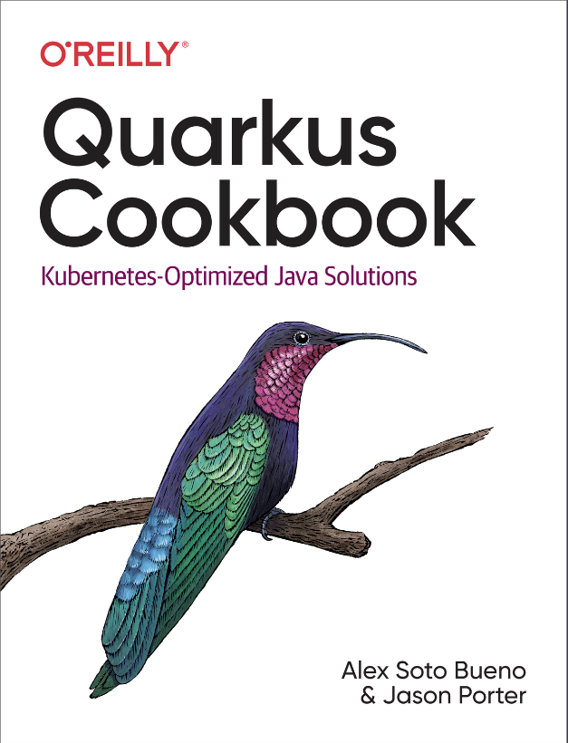

# Quarkus-cookbook

    

---

## Documentation

* HTML <https://developers.redhat.com/e-books/quarkus-cookbook>

---

## About

Optimized for Kubernetes, Quarkus is designed to help you create Java applications that are cloud-first, container-native, and serverless capable. With this cookbook, authors Alex Soto Bueno and Jason Porter from Red Hat provide detailed solutions for installing, interacting with, and using Quarkus in the development and production of microservices

The recipes in this book show mid-level to senior developers familiar with Java enterprise application development how to get started with Quarkus quickly. You'll become familiar with how Quarkus works with the wider Java ecosystem and discover ways to adapt this framework to your particular needs.
In this book, you will learn how to:

* Shorten the development cycle by enabling live reloading in dev mode
* Connect to and communicate with Kafka
* Develop with reactive programming model and easily add fault tolerance to your services
* Build your application as a Kubernetes-ready cluster
* Ease development with OpenAPI and test a native Quarkus application

---

## Excerpt

We said that Quarkus is meant to run within Kubernetes. That sounds great, but we know lots of things can run within Kubernetes. Throw your application in a Docker container, and it will run on Kubernetes. While this is true, there are a number of things that traditionally have to be done to properly tune, size, and configure your application to run efficiently within Kubernetes. You also have to pull out your text editor of choice and craft multiple YAML files—and let’s be honest, no one really enjoys doing all that

 ---

## 🦸 Author

<a href="#">
 
 

Made by Douglas Souza 👋🏽 Get in touch!

---

## README versions

[English 🇺🇸](./README.md)
